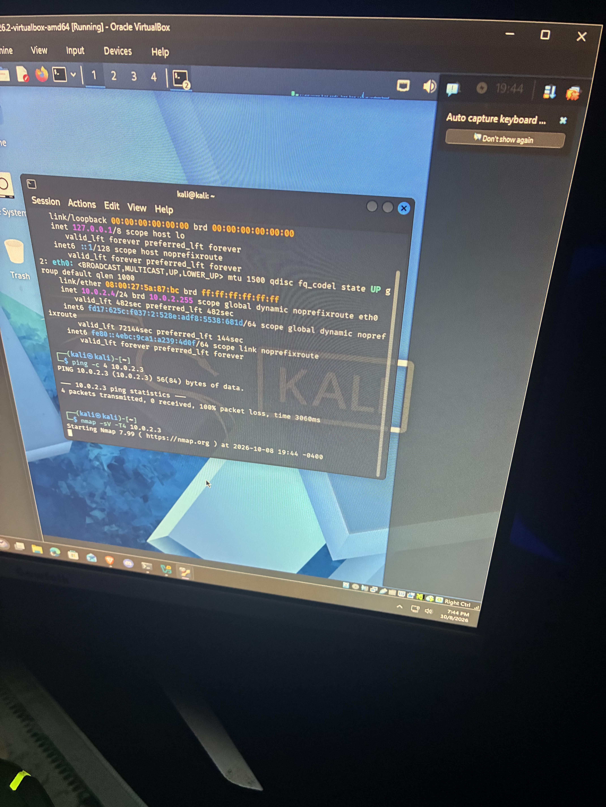
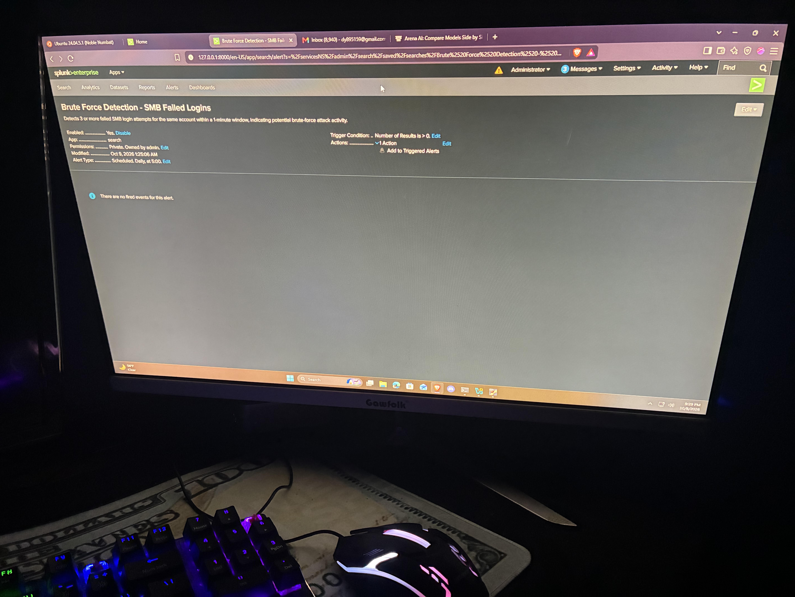

Markdown

# Scenario 1: SMB Brute Force Attack 

## Objective
Simulate a real-world credential brute-force attack against a Windows SMB service, then detect it using Splunk.

## Attack Steps

1. **Reconnaissance** — Used Nmap to scan the target Windows 10 machine and identify open ports.
nmap -sV -T4 10.0.2.3

text

Result: Ports 135, 139, 445 (SMB) found open.

2. **Target Setup** — Created a local Windows user account with a weak password to simulate a realistic target credential.
net user testuser Password123! /add

text

3. **Brute Force Attack** — Used NetExec from Kali Linux to attempt multiple passwords against the SMB service.
nxc smb 10.0.2.3 -u testuser -p passwords.txt

text

## Detection

Built a custom Splunk SPL query to detect 3+ failed login attempts within a 1-minute window, followed by a successful login — a classic brute-force signature.
index=main sourcetype="WinEventLog:Security" EventCode=4625 Account_Name=testuser
| bin _time span=1m
| stats count as failed_attempts by _time, Account_Name, Source_Network_Address
| where failed_attempts >= 3 AND Account_Name="testuser"

text

This was converted into a scheduled Splunk Alert that runs every 5 minutes, automatically flagging this pattern if it occurs.

## Results 

- Captured 3 failed logon events (EventCode 4625) and 1 successful logon (EventCode 4624), all originating from the attacker IP (10.0.2.4)
- Splunk alert successfully triggered, confirming automated detection capability

## Lessons Learned

- Windows Event 4625 can contain duplicate/multivalue Account_Name fields due to NTLM authentication quirks, requiring additional filtering in SPL queries
- Cron-based scheduling in Splunk alerts offers more precise control than preset interval options
